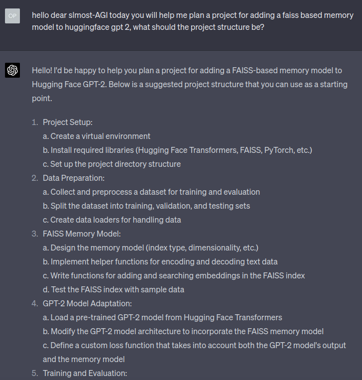
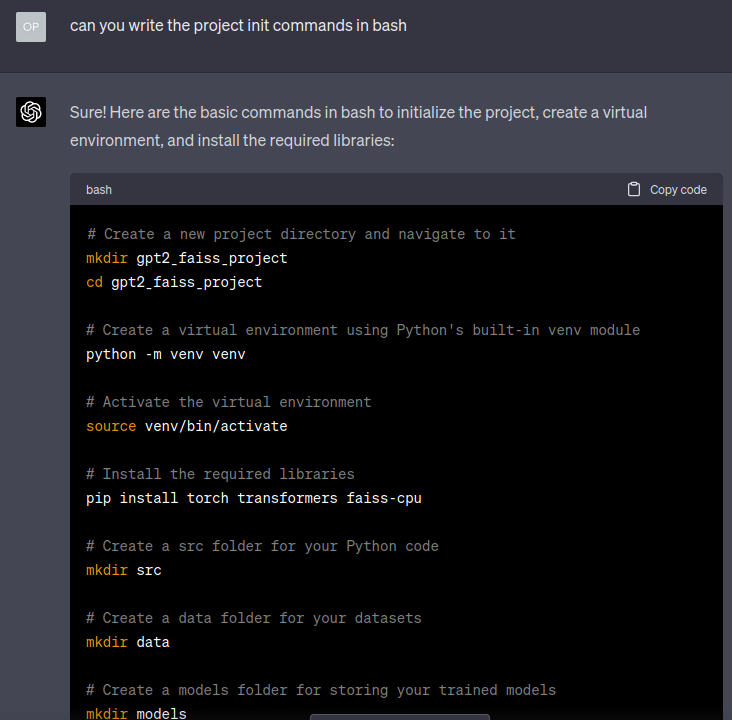
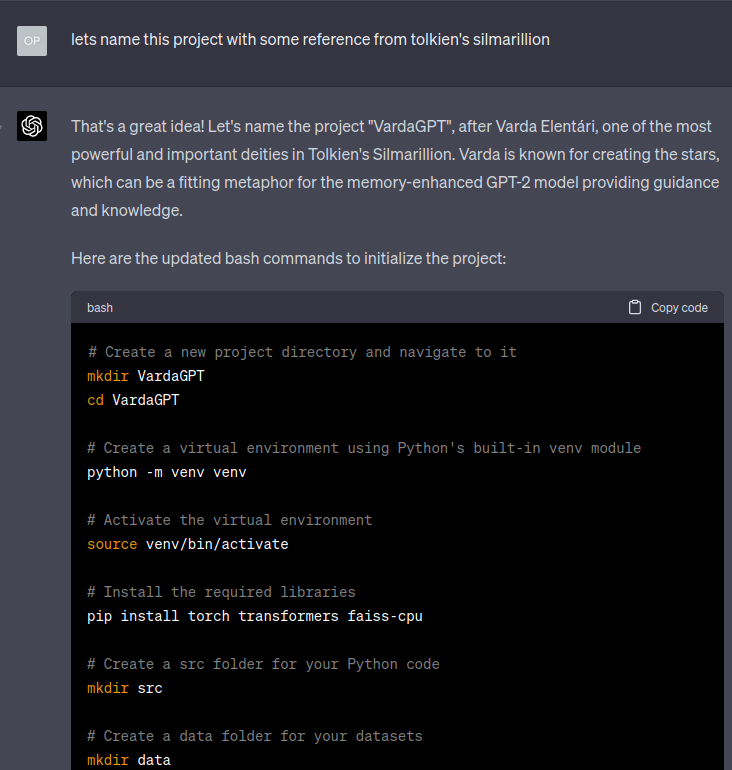
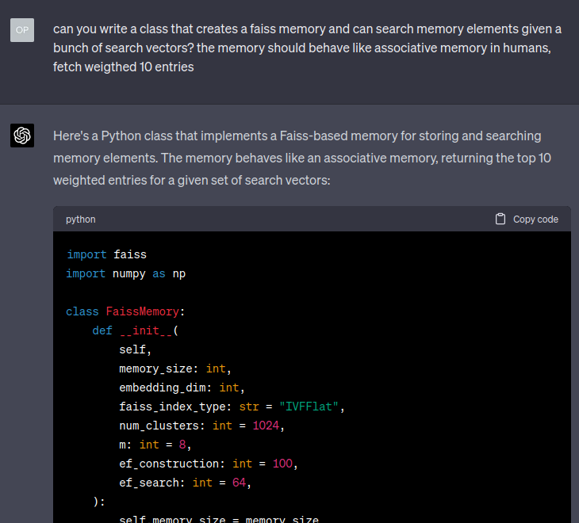
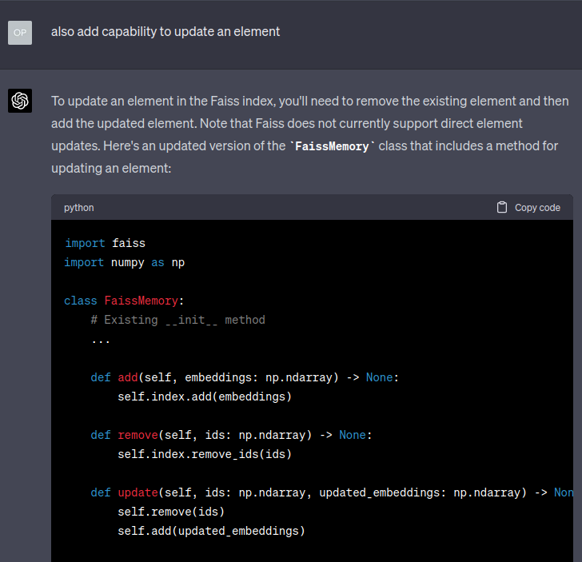
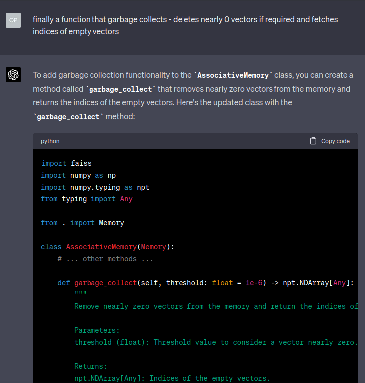
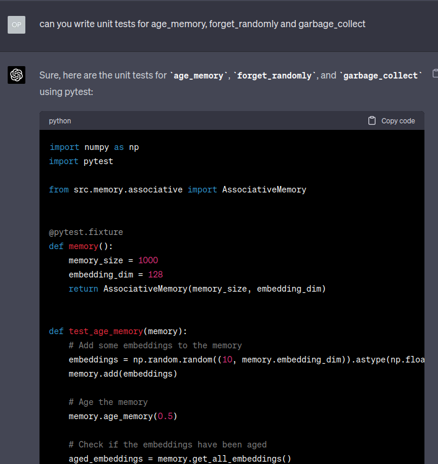
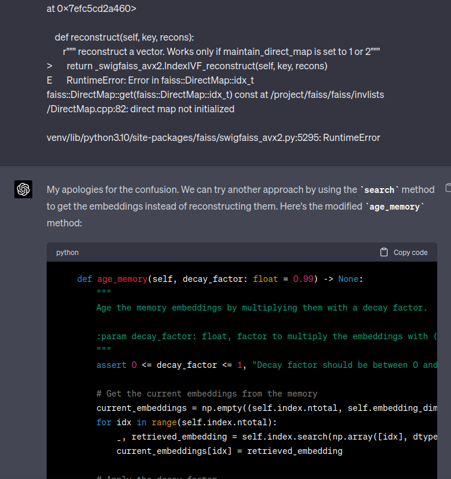
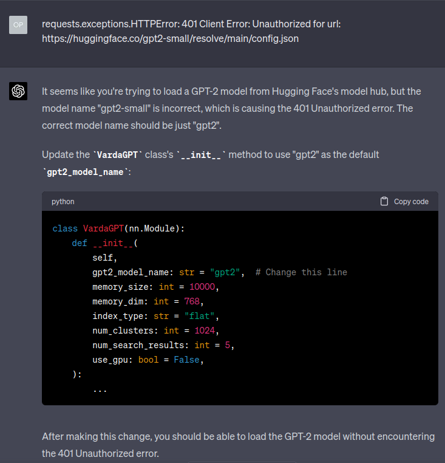
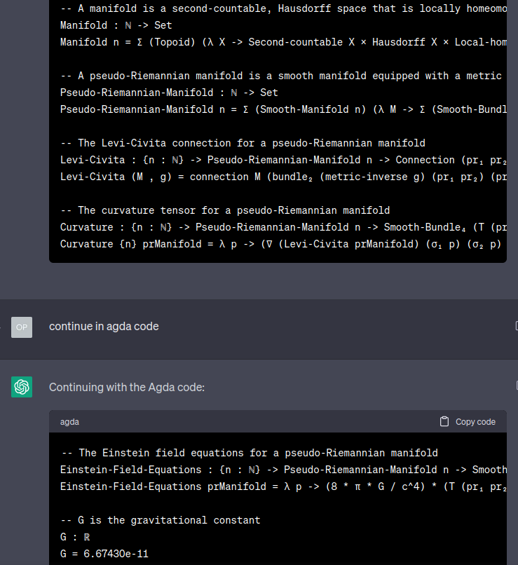

# Story of this project 😅

## Background 🤔

With all the hype around ChatGPT, I wondered how much impact ChatGPT really had.
I mean, for a programmer, would ChatGPT be like a pair programmer? Like GitHub
Copilot++? Or would ChatGPT totally replace programmers so that product managers
could tell it what feature to build, and it would just build it!

Imagine a bunch of product managers sitting in a sprint planning meeting where,
after signing off on the tasks to be done this sprint and starting the sprint,
ChatGPT was deployed on those tasks. The sprint lasted for about 2 hours, and
everyone met again to do the next day's sprint grooming. 😆

## Project Idea 💡

Now, what the heck should I build to test this? Why not try attaching a memory
module to a GPT? I've seen some folks on the internet complain about the "low
memory" problem of language models. I've also used FAISS and FLANN before, so I
am familiar with how to technically achieve this. Whether it will actually work
or not—well, my 1080Ti is like an old man now, and I don't have the money to
train this thing on AWS anyway. Let's aim for unit tests to work then.

## Process 🏃

Okay.

I started with the project plan:

Then I made ChatGPT generate the project foundations, step by step, from
creating project directories, Makefile, README, pre-commit, vscode settings for
the same tools in pre-commit, setup.cfg, and a GitHub workflow to run tests. In
each case, I had to specify exactly what I wanted it to generate.

Yes, I made ChatGPT choose the project name as well.

If I forgot something, I would go back and ask ChatGPT to add it:

In fact, I found it better to let ChatGPT generate a toy-ish version of the code
first, then let it add things to it step-by-step. This resulted in much better
output than, say, asking ChatGPT to generate production-quality code with all
features in the first go. This also gave me a way to break down my requirements
and feed them one at a time - as I was also acting as a code-reviewer for the
generated output, and so this method was also easier for me to work with.

  
 

Of course, I made ChatGPT write unit tests, and if they failed, I would just
copy the pytest output and feed it back into ChatGPT.

 

ChatGPT even figured this out!:

The result - I present to you
[VardaGPT](https://github.com/ixaxaar/vardagpt)—every inch of this repository
was generated by ChatGPT-4! It took a few hours, mostly around 3 weekends,
mostly at odd times, to generate this project.

## Experience 😮

It felt neither like a Copilot++ nor like the product manager scenario but
rather all at the same time. Sometimes I was amazed at what ChatGPT was able to
understand, sometimes I had to stubbornly push it to go in a certain direction,
sometimes it generated things I did not think of, sometimes I got super
frustrated while making ChatGPT fix the code in a certain way.

It was more like handholding a fresh grad who had absorbed all of human
knowledge but needed someone to tie various parts of that knowledge to create
something useful.

ChatGPT is definitely a productivity multiplier. I think it is rather a
differential productivity multiplier, as it would enhance more the capabilities
of those who already know more. If I did not understand deep learning and FAISS,
or how projects are structured, I don't think I would have been able to pull
this off. On the other hand, it also has some sort of a leveling effect—I have
not worked on PyTorch in a while, have no idea of FAISS's new APIs, etc., but
these gaps were filled in by ChatGPT.

Finally, it was also tiring. Imagine being reduced to giving only instructions
and doing code review. Reading and understanding code is tiring!

## Conclusion ❓

It looks like my job is safe this year. Time to generate an elaborate software
project and claim supremacy on my ChatGPT usage abilities to hedge against next
year.

I wonder if by the time ChatGPT-6 comes out, would engineering teams be like,
"Hey, let's generate our own Grafana with a purple theme 😄".

## Aside 🦄

I could not resist but add this bit. ChatGPT is great at generating Agda! Maybe
this would also be the ultimate tool that can be used to formalize all of pure
math? 😱

